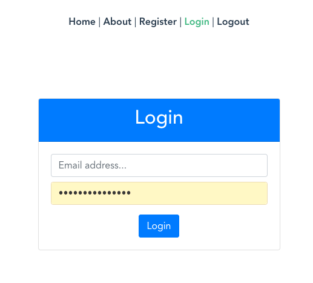

# Vue + Amplify Auth Hello World
This project is based on [Jennifer Bland's](https://www.freecodecamp.org/news/how-to-add-authentication-to-a-vue-app-using-aws-amplify/) tutorial on adding authentication to a Vue app with Amplify.

**This branch** adds route guards to the `About` page. When trying to access the page without authenticated, the user is redirected to the `Login` page. The page is loaded if the user is already logged in. After logged out, the user is redirected to the main page.

## Project Overview
This project is entirely built on top the default Vue App created by Vue CLI. `login.vue` and `register.vue` _Views_ are added to respectively enable user login and signup. 

### Login Screen



This screen just shows two input boxes that enable user to inform email and password for login. In the case of a successful login, a `alert` message is shown and the user is redirected to the main page by default.

### Register Screen


This screen enables user to signup to the service. A message is shown in case of success.

### Navbar


A final change was adding a `logout` link in the navbar. It shows a message after the logout and the user is redirected to the main page.

## Dependencies

This branch keeps previous added dependencies:`aws-amplify`, `vue-router`, `bootstrap@4.6.0`, `jquery` & `popper.js`.

## Project setup

* Installing libraries

```
yarn install
```

* Compiles and hot-reloads for development

```
yarn serve
```
